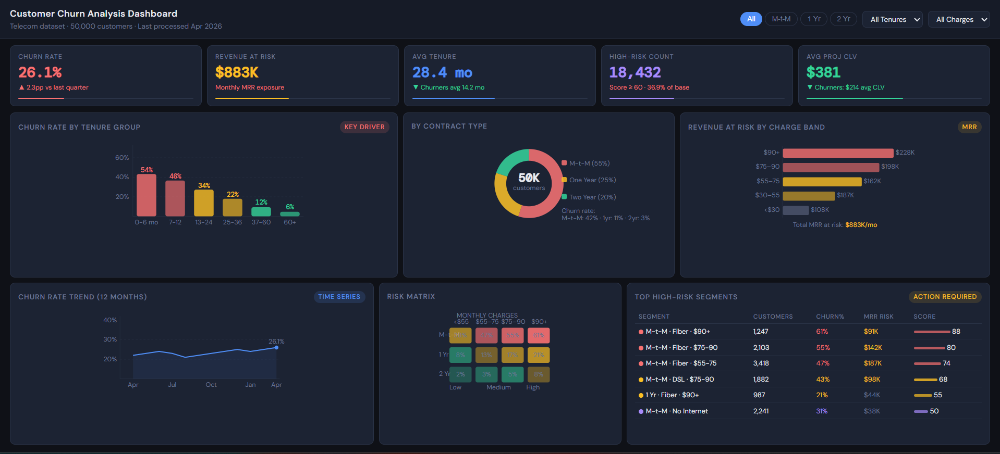
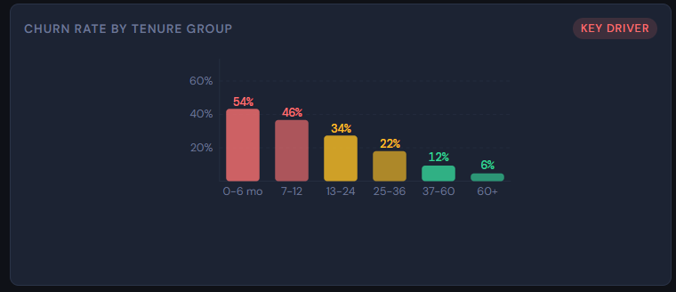
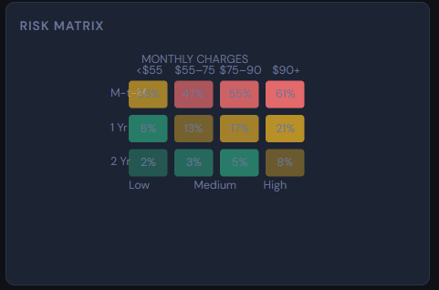

# Customer Churn Analysis

Enterprise-grade churn analysis pipeline built with Python and Tableau.

## Dashboard Preview

### Full Dashboard

### Churn Rate by Tenure

### Risk Heatmap

## What This Does
- Preprocesses raw customer data (handles millions of rows)
- Engineers churn risk scores and customer segments  
- Outputs Tableau-ready aggregated datasets

## Files
| File | Description |
|---|---|
| `churn_preprocessing.py` | Main pipeline script |
| `data.csv` | Sample input dataset |
| `tableau_dashboard_guide.md` | Step-by-step Tableau build guide |
| `data_dictionary.md` | Column reference |

## How to Run
pip install pandas numpy tqdm pyarrow fastparquet
python churn_preprocessing.py --input data.csv --output output/

## Output
- `churn_tableau_extract.csv` — aggregated Tableau data source  
- `churn_high_risk_detail.csv` — top 10K high-risk customers
